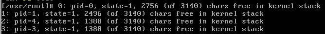

# 实验6 中断与系统调用

## 实验目的

1. 加深对设备管理基本原理的认识，了解键盘中断、扫描码等概念
2. 掌握 Linux 使用系统调用的基本原理

## 实验内容

| 步骤 | 类型 | 内容 |
| :--- | :--- | :--- |
| Step1 | 编程 | 修改进程状态表 |
| Step2 | 编程 | 结合键盘中断，实现系统调用 sys\_ver |


本实验在 Linux 0.11 源码上进行修改。


### Step 1 修改进程状态表        

        Linux 0.11 中按下 F1 ~ F12 中的任一功能键，系统将打印任务状态，如图 6-1 所示。

        通过追踪键盘中断与进程控制的相关代码，尝试将 state 后的数字替换为下表中的英文。

| 状态 | 表示 |
| :--- | :--- |
| running | 0 |
| interruptible | 1 |
| uninterruptible | 2 |
| zomble | 3 |
| stopped | 4 |

### Step 2 实现系统调用 sys\_ver

        参照 Linux 0.11 中已有的系统调用，尝试添加一个系统调用 sys\_ver。结合键盘中断，使用户在按下 F12 时，屏幕打印出 “NEUOS exp 6”.

## 报告要点

1. 简述如何实现对进程状态表的修改。
2. 描述如何新建系统调用 sys\_ver，展示关键代码与运行截图。

## 实验提示

       exp6/kernel/chr\_drv/kb.S 是一个键盘驱动程序，主要包括键盘中断处理程序。kb.S 的 key\_table 标号后的代码是一张子程序地址跳转表。当取得**扫描码**后就根据此表调用相应的扫描码处理子程序。

        kb.S 的 func 标号后是子程序处理功能键。


跟踪函数的调用时，使用全局搜索等工具将显著提升效率。


